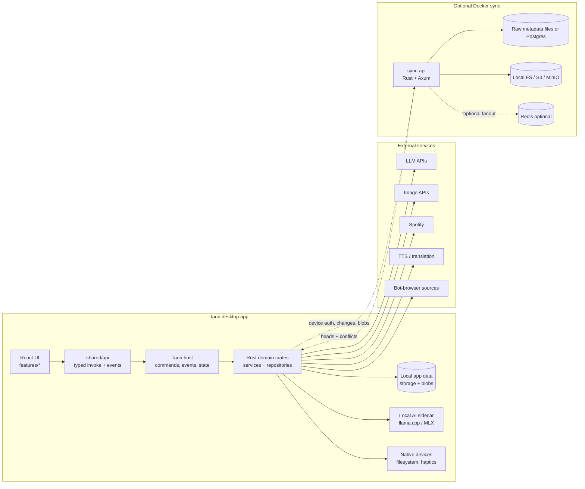
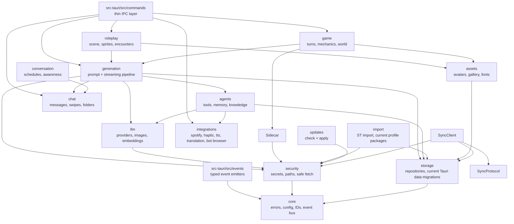
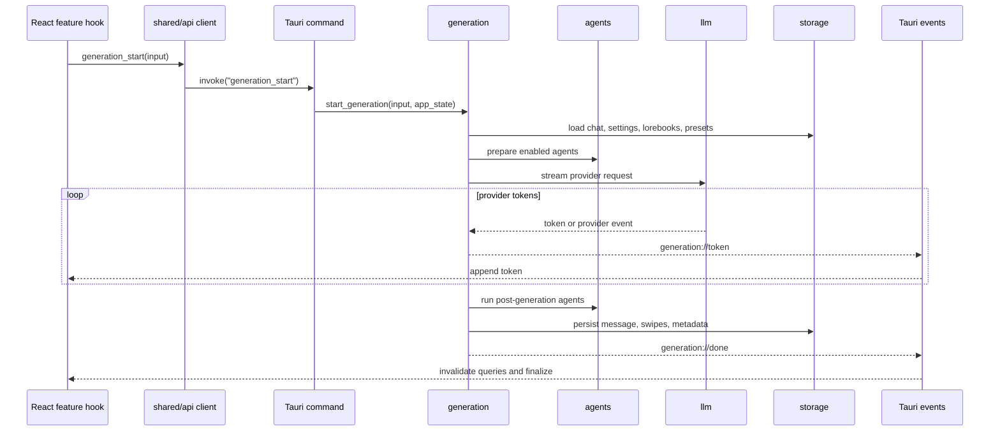
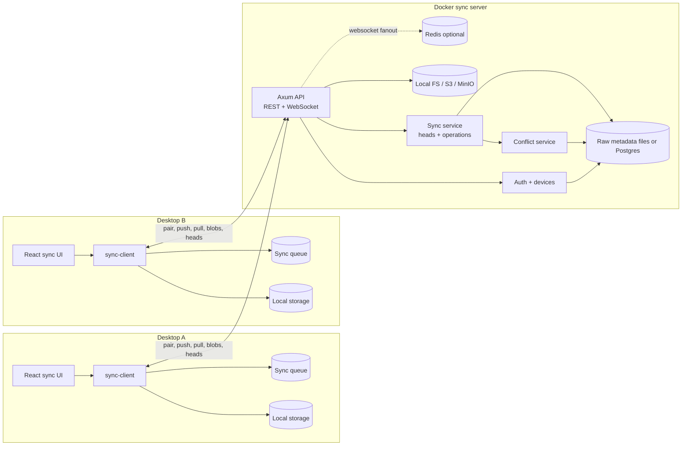
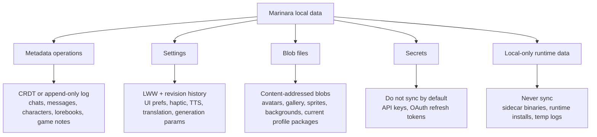

# Mermaid Diagrams

These diagrams mirror the visual HTML pages. They are kept in Markdown so they can render in GitHub and be copied into issues, PRs, or external docs.

## Platform Map

## Rust Module Dependency Graph

## Generation Runtime Sequence

## Self-Hosted Sync Topology

## Sync Lifecycle

```mermaid
sequenceDiagram
  participant UI as React UI
  participant LOCAL as Local Rust repositories
  participant QUEUE as Sync queue
  participant CLIENT as Sync client
  participant SERVER as Docker sync API
  participant DB as Sync metadata DB
  participant BLOB as Blob store

  UI->>LOCAL: save chat/message/file/settings
  LOCAL->>QUEUE: append operation + blob refs
  CLIENT->>SERVER: push operations since cursor
  SERVER->>DB: validate and store changes
  SERVER-->>CLIENT: ack heads + missing blob refs
  CLIENT->>BLOB: upload missing blobs
  SERVER-->>CLIENT: websocket heads update
  CLIENT->>SERVER: pull missing operations
  SERVER->>DB: read changes by collection
  SERVER-->>CLIENT: changes + conflict markers
  CLIENT->>LOCAL: merge safe changes
  CLIENT-->>UI: sync://status and sync://conflict
```

## Data Classification

